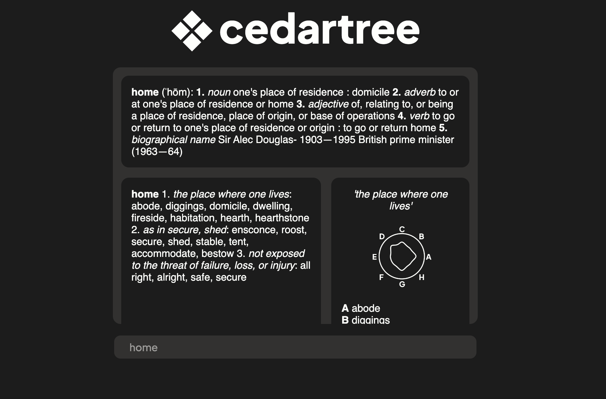

# cedartree
- work in progress: word similarity via glove6b unsupervised learning dataset not yet included
- pixi module is not included, project made using node + express
- diagram uses matplotlib to display word similarity + closed curve interpolation with parametrics splines (see wordsim.py)

